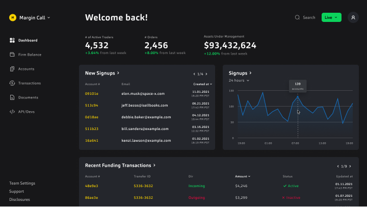

# Integration

&nbsp;

If you are coming to Alpaca for the first time to build something using Broker
API, please sign up for the dashboard. In this dashboard, you can acquire your
API key for the sandbox environment and gain access to the test data
immediately.

The sandbox behaves the same way as the live environment for the most parts with a
few mocked. With this environment, you should be able to build a complete
demo app that you can show to your friends, investors and other community
members. Going live from here would be a matter of testing and updating the API
calls for the mocked endpoints.

To go live, we will onboard you for the business integration. For more details
of this step, please refer to [Going Live](/docs/integration/#going-live)

Once you go live, you can keep using the same dashboard to view customer
activity and resolve issues for them. You will also get support for the broker
operations and technology support based on the agreement.

## Dashboard

Broker API users have access to a dashboard where you can view accounts
and activities of your end users. You can sign up for an account with your email for free and get started with the sandbox API key.

You can invite team members to your account and view the same data as you make
changes using API. You can switch the sandbox and live environment through this
same dashboard. With all activity data, you can use this as your operation
dashboard when going live as well.

You can assign different roles to each team member you invite.

## Sandbox

You have full access to the sandbox while developing your integration for free
of charge. The sandbox is built with the same code as live with a few different
behaviors.

### Account Approval

The account approval process slightly differs depending on your use case and you
may need to test different scenarios in the sandbox first. The sandbox is fully
automated with the account approval simulation with test fixtures, while the
live environment may involve manual review and approval steps in some cases.

### Trading

All trades that happen in the sandbox environment are simulated. The simulator
engine is the same as our paper trading engine. All assumptions and mock logic
follow the paper trading behavior. Please refer to the [Trading API
documentation](https://alpaca.markets/docs).

### Funding

The funding integration can vary depending on your country as well as the use
case. In the sandbox environment, it is simplified with Transfer API. In order
to simulate the deposit (credit) or withdrawal (debit) on the user account,
simply call the POST method of Transfer API and it will become effective
immediately. In the live environment, you may need to use Banks API as well as
ACH endpoints if you are using ACH transfer within the USA. More details are
described in the <section>.

### Journal Approval

When you make a Journal API request, if the amount exceeds the pre-configured
limit amount, it goes into a pending status. In the live environment, Alpaca’s
operation team is notified and manually reviews your request. In the sandbox
environment, this process is simulated.

## Firm Accounts

A firm account is an account owned by your business for the purpose of
operations. We could support a variety of accounts based on your needs. Here are
some basic ones.

- _Deposit Account_: This is a deposit clearing account required for all clients
  going live. The exact amount required is based on the number of accounts and
  the number of trades. This account balance moves rarely.
- _Sweep Account_: This is the main firm account you will be using to journal
  funds between your firm and your users. It can be used to simulate instant
  funding, to provide intraday credit and many other flexible funding
  strategies.
- _Rewards Account_: This account can be used to trigger rewards you want to set
  up on your app to fuel growth such as sign up rewards, referrals rewards and
  achievement based rewards. This account supports both cash and stock rewards.

You can view your Firm Account balance from the Broker Dashboard along with all
activities associated with the account.

## Going Live

Once you complete the sandbox integration, the next step is to go live. Please
have another read about the differences between sandbox and live in the above
section, and prepare for the go-live items. Generally speaking, we would need
the following from you to open the live system for you.

- Your business entity documents, such as certificates of incorporation and tax
  ID
- Screenshots/video of your application interfaces
- KYC process document if you are fully-disclosed
- Expectation for the funding process if you already have something in mind

And with all this information provided, we will have a business agreement
between you and Alpaca. We recommend allowing for enough time for the
administrative tasks listed above, as we wouldn’t want to delay your production
launch unnecessarily.

When launching into production, we recommend to start from alpha/beta launch
with a limited access, to ensure the operation works well, both on your side and
Alpaca’s side. Once the process is understood, you can go ahead with a full
public launch. We are happy to consider participating in your PR / marketing
launch!

&nbsp;
